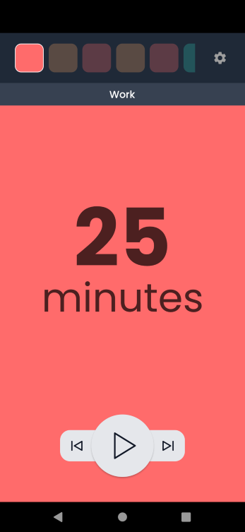

# Pomodoro Timer Clone

 

### Functions

* Work, Break, Long Break 타이머
* 시간 스케줄을 설정에서 관리
* 3가지 시간 표시 방법:  분:초, 분, % 
* 애니메이션 전환 효과들

### Packages

- provider: 상태관리
- pausable_timer: 일시정지 가능한 타이머
- google_fonts: poppins 폰트 사용 용도
- animate_do: 아래에서 위로 나타나는 효과 구현
- lottie: GIF 대체 움직이는 이미지
- flutter_svg: SVG 이미지 표현
- shared_preferences: 기기에 설정 저장
- font_awesome_flutter: github 아이콘 표현
- url_launcher: 외부 사이트 오픈

### What was difficult

* 시작 버튼 주위로 작은 호(arc)가 blur 처리된 상태로 돌아가기
* 분 단위의 시간 변경 시 이전 분은 위로 올라가며 사라지고 새로운 분은 아래에서 나타나기
* 상단의 Stage를 나타내는 표시자가 애니메이션 효과를 가지면서 사라지기

### Credit

[another-pomodoro](https://another-pomodoro.app/timer/)  프로젝트를 클론 코딩으로 구현
